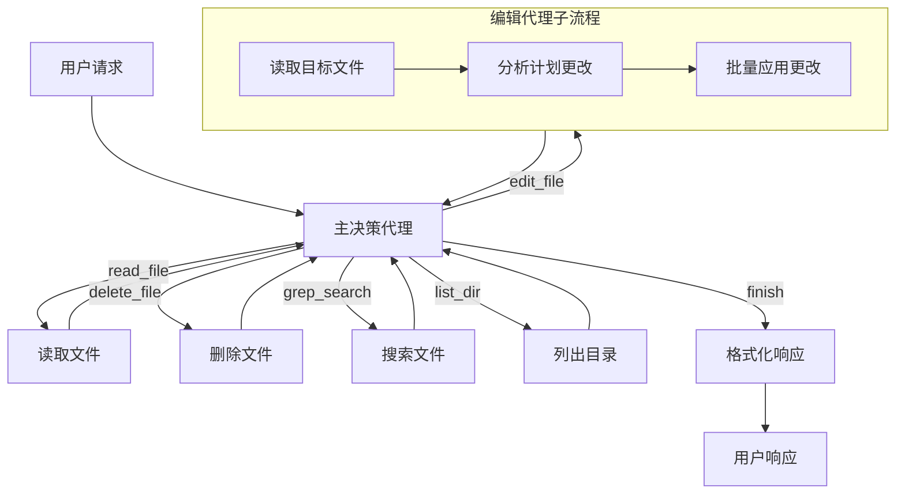

# AI Agent 系统分析报告

## 项目概述

本项目是一个基于 **PocketFlow** 框架构建的 AI 编码代理系统，旨在模拟 Cursor AI 的核心功能。该系统能够读取、编辑、搜索代码文件，并通过智能决策循环完成用户的编码任务请求。

**核心文件**: 
- `flow.py` (主逻辑), 
- `main.py` (入口点), 
- `utils/` (工具集)

## 1. 核心架构与设计模式

### 1.1 架构设计

本项目采用 **双代理架构** (Dual-Agent Architecture)：

- **主决策代理 (MainDecisionAgent)**: 负责工具选择和任务调度
- **编辑代理 (Edit Agent)**: 专门处理文件编辑操作的子流程

### 1.2 设计模式

**ReAct (Reasoning + Acting) 模式**: 
- `flow.py:105-264` 实现了完整的 ReAct 循环
- 感知 (用户查询 + 历史) → 思考 (LLM 决策) → 行动 (工具执行) → 观察 (结果记录)

**工作流编排**: 使用 PocketFlow 框架的 Node/Flow 模式


### 1.3 模块化设计

**核心模块**:
- **LLM 模块**: `utils/call_llm.py` - LLM 调用抽象层
- **工具模块**: `utils/*.py` - 文件操作工具集
- **记忆模块**: Shared memory 历史记录系统
- **评估模块**: 内置日志和结果验证

设计合理性: ⭐⭐⭐⭐☆ (4/5)
- 优点: 模块职责清晰，接口统一
- 缺点: 缺乏插件化扩展机制

## 2. LLM 集成与优化

### 2.1 模型集成

**实现位置**: `utils/call_llm.py:23-82`

**模型选择**: 
- 默认使用 Anthropic Claude 3.7 Sonnet
- 支持环境变量配置 (`ANTHROPIC_REGION`, `ANTHROPIC_PROJECT_ID`)

**抽象层设计**:
```python
def call_llm(prompt: str, use_cache: bool = True) -> str:
    # 统一的 LLM 调用接口
    # 支持缓存、日志、错误处理
```

### 2.2 成本与延迟优化

**Token 优化策略**:
- 提示词工程减少冗余内容
- 历史摘要而非完整历史传递
- 缓存机制避免重复调用

**延迟处理**:
- 简单的重试机制 (PocketFlow 内置)
- 无显式超时控制
- 无熔断机制

**优化建议**: 
- 添加请求超时和速率限制
- 实现 Token 使用统计和预算控制

## 3. Prompt & Context Engineering

### 3.1 主要 Prompt 分析

#### 3.1.1 主决策 Prompt (`flow.py:121-205`)

**用途**: 工具选择和参数生成
**上下文提供**:
- 用户查询
- 完整行动历史 (带结果)
- 可用工具详细说明
- YAML 响应格式要求

**优秀设计**:
- ✅ 使用链式思考 (CoT) 要求解释决策原因
- ✅ 提供工具使用示例
- ✅ 结构化输出要求 (YAML)
- ✅ 包含历史上下文避免重复操作

#### 3.1.2 编辑分析 Prompt (`flow.py:516-565`)

**用途**: 代码编辑位置分析
**上下文提供**:
- 完整文件内容
- 编辑指令
- 代码编辑模式
- 行号定位规则

**优秀设计**:
- ✅ 要求逐步推理过程
- ✅ 提供具体的编辑操作格式
- ✅ 包含边界条件处理说明

#### 3.1.3 响应生成 Prompt (`flow.py:707-723`)

**用途**: 最终结果格式化
**设计特点**:
- 关注结果而非过程
- 用户友好的语言风格
- 结构化信息使用 YAML

### 3.2 优化建议

**缺失的信息**:
- ❌ 系统性能约束 (Token 限制)
- ❌ 安全边界说明
- ❌ 回退策略指引

**改进建议**:
- 添加 Token 预算提示
- 明确文件操作的安全限制
- 提供错误处理指导

## 4. 工具设计

### 4.1 工具抽象层

**工具列表**:
1. `read_file` - 文件读取 (`utils/read_file.py`)
2. `edit_file` - 文件编辑 (多步骤流程)
3. `delete_file` - 文件删除 (`utils/delete_file.py`)
4. `grep_search` - 模式搜索 (`utils/search_ops.py`)
5. `list_dir` - 目录列表 (`utils/dir_ops.py`)
6. `finish` - 流程结束

**统一接口**:
- 所有工具通过 `params` 字典传递参数
- 返回 `(result, success)` 元组
- 错误信息标准化

### 4.2 工具描述生成

**实现方式**: 硬编码在决策 Prompt 中 (`flow.py:130-192`)

**描述质量**: ⭐⭐⭐⭐☆ (4/5)
- 清晰的参数说明
- 实用示例
- 但缺乏动态生成能力

### 4.3 工具验证与安全

**验证机制**:
- 参数存在性检查 (`flow.py:233-238`)
- YAML 结构验证
- 行号范围验证 (`flow.py:602-604`)

**安全措施**:
- 文件存在性检查
- 路径规范化处理
- 错误隔离机制

**安全缺陷**:
- ❌ 无路径遍历攻击防护
- ❌ 无敏感文件访问限制
- ❌ 无操作确认机制

## 5. 记忆管理 (Memory)

### 5.1 短期记忆

**实现位置**: `flow.py:28-100` (format_history_summary)

**管理策略**:
- 完整的行动历史记录
- 结果和上下文存储
- 智能摘要生成

**上下文窗口**: 无硬性限制，依赖 LLM 上下文长度

### 5.2 长期记忆

**当前状态**: ❌ 未实现
- 无向量数据库集成
- 无经验存储机制
- 无知识检索功能

### 5.3 状态管理

**Shared Memory 结构** (`flow.py:250-260`):
```python
{
    "user_query": str,           # 用户查询
    "working_dir": str,          # 工作目录
    "history": [                 # 行动历史
        {
            "tool": str,         # 工具名称
            "reason": str,       # 使用原因
            "params": dict,      # 参数
            "result": any,       # 结果
            "timestamp": str     # 时间戳
        }
    ],
    "edit_operations": list,     # 编辑操作临时存储
    "response": str              # 最终响应
}
```

## 6. 任务规划与执行

### 6.1 任务分解

**实现方式**: LLM 驱动的逐步决策
- 不预先分解复杂任务
- 根据当前状态决定下一步
- 支持多步骤操作流程

**优点**: 灵活适应各种任务类型
**缺点**: 缺乏整体任务规划视野

### 6.2 自我反思与修正

**反思机制**: ✅ 部分实现
- 历史结果影响后续决策
- 错误结果会终止或重试

**缺失功能**: ❌
- 无系统性的失败分析
- 无替代策略尝试
- 无人类反馈循环

## 7. 评估与监控

### 7.1 成功度量

**评估方式**:
- 操作成功/失败状态
- 最终结果用户满意度 (间接)
- 无量化评估指标

**缺陷**: ❌ 缺乏系统化的评估体系

### 7.2 可观测性

**日志系统**: ✅ 完善实现
- 操作日志 (`coding_agent.log`)
- LLM 调用日志 (`logs/llm_calls_*.log`)
- 多级别日志记录

**监控内容**:
- 完整的提示词和响应
- 工具调用参数和结果
- 错误和异常信息

**优点**: 完整的可追溯性
**缺点**: 无实时监控仪表板

## 8. 安全、伦理与可靠性

### 8.1 幻觉缓解

**措施**:
- 结构化输出约束 (YAML)
- 参数验证和断言
- 上下文 grounding

**效果**: ⭐⭐⭐☆☆ (3/5) - 基本防护但不够全面

### 8.2 安全护栏

**现有措施**:
- 文件存在性验证
- 参数范围检查
- 错误隔离

**缺失的安全功能**: ❌
- 敏感操作确认
- 路径安全验证
- 权限控制
- 操作回滚机制

### 8.3 可靠性

**错误处理**: ✅ 全面实现
- Try-catch 包装所有操作
- 友好的错误消息
- 状态一致性维护

**可靠性问题**: ⚠️
- 可能进入无限循环 (无最大步数限制)
- 无超时终止机制
- 无熔断保护

## 9. 总结与建议

### 9.1 项目优势

1. **架构设计优秀**: 清晰的 ReAct 模式实现
2. **模块化程度高**: 工具和代理职责分离
3. **可观测性好**: 完整的日志记录系统
4. **错误处理健全**: 全面的异常捕获和处理
5. **提示词工程质量高**: 详细的上下文和指导

### 9.2 改进建议

**高优先级**:
1. 添加安全防护机制 (路径验证、操作确认)
2. 实现循环检测和最大步数限制
3. 添加超时和熔断机制

**中优先级**:
4. 实现长期记忆存储 (向量数据库)
5. 添加评估指标体系
6. 实现插件化工具扩展

**低优先级**:
7. 支持多模型切换
8. 添加 Web 界面
9. 实现协作功能

### 9.3 技术债务

- 硬编码的模型配置
- 缺乏单元测试
- 文档不完整
- 安全审计缺失

---

**报告生成时间**: 2025-08-24  
**分析版本**: 项目最新 commit
**分析工具**: Claude Code + 手动代码审查